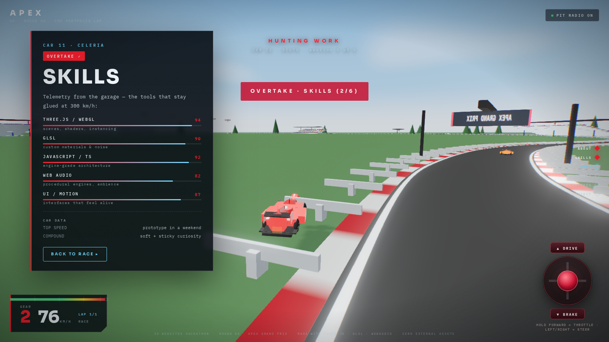

# APEX · MONZA 1998 GRAND PRIX — the portfolio you win by driving

**Live site → [https://yashwanth07-debug.github.io/apex/](https://yashwanth07-debug.github.io/apex/)**
**Source → this repository · MIT licensed**



---

## The idea

A portfolio, re-imagined as a Formula 1 Grand Prix at the iconic **Autodromo Nazionale Monza (1998 Layout)**.

You arrive on the grid of Monza's historic high-speed temple at golden hour — grandstands
packed with bouncing crowds, flags waving, and the start gantry glowing red.
Lights out: you pilot the **Ferrari F1 #23 car** with an on-screen joystick 🕹️
(hold forward = throttle, drag sideways = steering), the holdable **DRIVE / BRAKE**
buttons, plain **W/A/S/D**, or sit back with **AUTO DRIVE**!

Ahead of you are **six rival cars**, each in its own livery, cruising the racing line.
Every rival carries a section of the portfolio — **About, Skills, Work, Journey,
Milestones, Contact**. Catch a car and pass it: the section unfolds trackside while
the race goes on around you.

Pass all six, cross the line, and the chequered flag falls: fireworks, confetti,
a P1 podium card — and links to GitHub, email, and this very repo.

**The race is the site. Finishing the lap *is* finishing the portfolio.**

---

## ⚡ Auto Drive Feature

Don't want to steer manually? Click the **⚡ AUTO DRIVE** button on the starting grid or HUD at any time:
- **Intelligent AI Cruise**: Anticipates upcoming curves, applies proactive braking into the Variante del Rettifilo and Variante Ascari chicanes, and opens full throttle down the Monza straights.
- **Dynamic Overtake Logic**: Senses rivals ahead and smoothly maneuvers into open passing lanes to pass every single competitor.
- **Full Lap Autonomous Finish**: Guides your car across the finish line, unlocking every portfolio chapter and triggering the chequered flag celebration.
- Seamlessly toggle between Auto Drive and manual steering at any moment.

---

## Controls

| Input | Action |
| --- | --- |
| ⚡ **AUTO DRIVE** | Autonomous AI driving, overtakes & race finish |
| 🕹️ **Joystick** | hold **forward** = throttle · drag **left/right** = steer · pull **back** = brake |
| **DRIVE / BRAKE** buttons | hold to accelerate / brake |
| **W / ↑** · **S / ↓** | throttle / brake |
| **A / ←** · **D / →** | steering |
| First input | starts the race (lights out) |
| 🏁 chequered flag | appears after completing the flying lap & passing the rivals |

---

## Tech list

- **Autodromo Nazionale Monza 1998 3D Model & Real Spline** — 3D terrain, trees, asphalt, rumble strips, and grandstands with Draco compression and high-fidelity textures.
- **Three.js** (r166) — scene graph, spline track ribbon, instanced crowd/rails/trees, Ferrari F1 2019 GLB streaming.
- **Vite 5** — build & dev server (deploys at `/apex/`).
- **GLSL** — 32km sky dome (gradient + sun + drifting procedural clouds), waving flags, crowd bounce injected via `onBeforeCompile`.
- **Web Audio API** — fully synthesized engine note (RPM → oscillator frequencies, gear stepping), wind, crowd loops, air horn at the flag.
- **EffectComposer** — UnrealBloom, custom speed-grade (chromatic aberration + vignette), FXAA, ACES output.

---

## Project layout

```
apex/
├─ index.html            # DOM: preloader, ignition card, HUD, Auto Drive, finish screen
├─ spa.html              # 3D Asset viewer for Monza circuit & Ferrari F1
├─ public/
│  └─ models/
│     ├─ monza.glb       # Draco-compressed Monza 1998 3D circuit environment
│     └─ ferrari_f1_2019.glb # Ferrari F1 2019 car model
├─ src/
│  ├─ style.css          # glass HUD, joysticks, Auto Drive pill, panels
│  ├─ main.js            # renderer, game loop, drive model, Auto Drive AI, rivals, overtakes, camera
│  ├─ data.js            # the six portfolio sections + rival liveries
│  ├─ world/
│  │  ├─ monza-track-data.js # Real 100-waypoint spline data for Monza 1998
│  │  ├─ monza.js        # Monza 3D glTF world loader
│  │  ├─ track.js        # Catmull-Rom circuit ribbon, kerbs, rails, gantries
│  │  ├─ environment.js  # sky, sun/shadow rig, grandstands, crowd, flags, trees
│  │  ├─ car.js          # procedural F1 kit car
│  │  └─ ferrari.js      # Ferrari F1 loader & material setup
│  ├─ core/
│  │  ├─ input.js        # joystick + hold buttons + keyboard → {throttle, steer}
│  │  ├─ audio.js        # synthesized engine / wind / crowd / horn
│  │  ├─ hud.js          # DOM drivers: speedo, rail, Auto Drive toggle, panels, finish
│  │  └─ post.js         # bloom + grade + FXAA pipeline
│  └─ util/noise.js      # deterministic RNG + fbm (CPU) + shared GLSL noise
└─ vite.config.js        # base /apex/ (GitHub Pages), VERCEL=1 → /
```

---

## Run it locally

```bash
npm install
npm run dev        # http://localhost:5173/apex/
npm run build      # → dist/ (static, deployable anywhere)
```

## Deploy

Static `dist/` output. The repo ships a Pages deployment on branch `gh-pages`;
visit → **https://yashwanth07-debug.github.io/apex/**

---

Built by **Yashwanth K.** · [github.com/yashwanth07-debug](https://github.com/yashwanth07-debug)
with Three.js, GLSL, Web Audio, and the Monza 1998 Grand Prix circuit.
